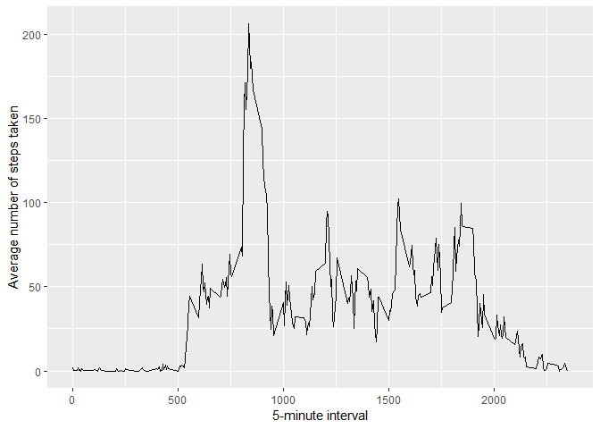

  
  
## Loading and preprocessing the data


```r
# Set working directory, load packages
setwd('D:/Dropbox/Coursera Reproducible Research/Project1')
library(ggplot2)

# Load the data
activity <- read.csv("activity/activity.csv")

# Process/transform data
activity$date <- as.Date(activity$date, "%Y-%m-%d")
```

## What is mean total number of steps taken per day?
  

```r
# Find the total of steps each day
totalSteps <- tapply(activity$steps, activity$date, sum, na.rm = T)

#Creat histogram of total steps each day
hist(totalSteps,
  col = "blue",
  main = "Histogram of total number of steps each day", 
  xlab = "Total number of steps each day",
  ylim = c(0,15),
  xlim=c(0,25000),
  breaks = seq(0,24000, by=2000))
```


```r
#Mean and median steps
mean(totalSteps)
```

```
## [1] 9354.23
```

```r
median(totalSteps)
```

```
## [1] 10395
```
  
## What is the average daily activity pattern?


```r
#Make a time series plot
avgDailyActivity <- aggregate(x=list(steps = activity$steps),
                      by=list(interval = activity$interval),
                      FUN=mean, na.rm=TRUE)

ggplot(data = avgDailyActivity,
  aes(x = interval, y = steps)) +
  geom_line() + 
  xlab("5-minute interval") + 
  ylab("Average number of steps taken")
```



```r
#Interval with maximum number of steps
avgDailyActivity[which.max(avgDailyActivity$steps), ]$interval
```

```
## [1] 835
```

## Imputing missing values


```r
#Calculate and report the total number of missing values in the dataset
sum(is.na(activity$steps))
```

```
## [1] 2304
```

```r
#Devise a strategy for filling in all of the missing values in the dataset
imputeSteps <- avgDailyActivity$steps[match(activity$interval, avgDailyActivity$interval)]

#Create a new dataset that is equal to the original dataset but with the missing data filled in.
activityImputed <- transform(activity, steps = ifelse(is.na(activity$steps), yes = imputeSteps, no = activity$steps))

#Make a histogram of the total number of steps taken each day
totalStepsImputed <- tapply(activityImputed$steps, activityImputed$date, sum, na.rm = T)

hist(totalStepsImputed,
  col = "blue",
  main = "Histogram of total number of steps each day (imputed)", 
  xlab = "Total number of steps each day",
  ylim = c(0,25),
  xlim=c(0,25000),
  breaks = seq(0,24000, by=2000))
```


```r
#Calculate and report the mean and median total number of steps taken per day
mean(totalStepsImputed)
```

```
## [1] 10766.19
```

```r
median(totalStepsImputed)
```

```
## [1] 10766.19
```

The imputed values differ from the estimates in the first part of the assignment. The imputation replaces missing values (default to 0) with the mean value for the interval, resulting in a a greater value for the imputed mean and median.

## Are there differences in activity patterns between weekdays and weekends?


```r
#Create a new weekday/weekend factor variable
activity$dayType <- sapply(activity$date, function(x) {
        if (weekdays(x) == "Saturday" | weekdays(x) =="Sunday") {y <- "Weekend"}
        else {y <- "Weekday"}
        })

#Make a panel plot containing a time series plot
activityDay <- aggregate(steps~interval + dayType, activity, mean, na.rm = TRUE)

ggplot(activityDay,
  aes(interval, steps, color = dayType)) +
  geom_line() +
  facet_grid(dayType ~ .) +
  xlab("5-minute interval") +
  ylab("Number of steps")
```


